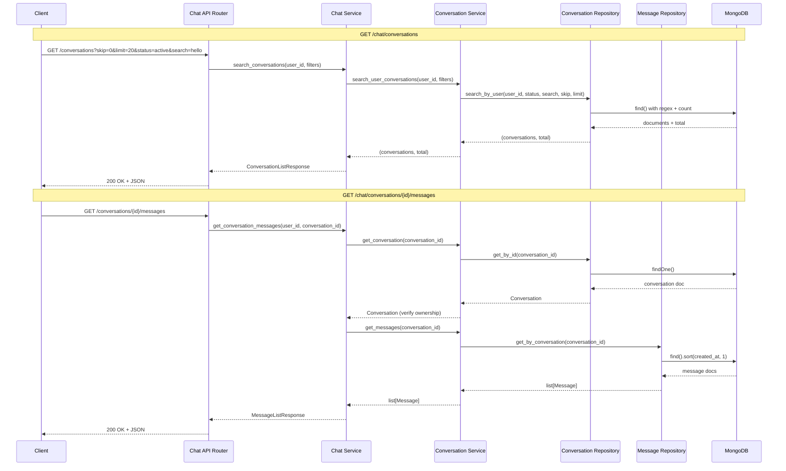

# Design Document: Chat Endpoints

## Overview

Feature này thêm 2 GET endpoints vào existing chat API để list conversations và get messages. Design follow existing patterns trong codebase với FastAPI router, Pydantic schemas, và MongoDB repository layer.

## Architecture



## Components and Interfaces

### 1. Response Schemas (`app/domain/schemas/chat.py`)

```python
from datetime import datetime
from typing import Optional
from pydantic import BaseModel
from app.domain.models.conversation import ConversationStatus
from app.domain.models.message import Attachment, MessageMetadata, MessageRole

class ConversationResponse(BaseModel):
    """Response schema for a single conversation."""
    id: str
    title: str
    status: ConversationStatus
    message_count: int
    last_message_at: Optional[datetime]
    created_at: datetime
    updated_at: datetime

class ConversationListResponse(BaseModel):
    """Response schema for paginated conversation list."""
    items: list[ConversationResponse]
    total: int
    skip: int
    limit: int

class MessageResponse(BaseModel):
    """Response schema for a single message."""
    id: str
    role: MessageRole
    content: str
    attachments: list[Attachment]
    metadata: Optional[MessageMetadata]
    is_complete: bool
    created_at: datetime

class MessageListResponse(BaseModel):
    """Response schema for conversation messages."""
    conversation_id: str
    messages: list[MessageResponse]
```

### 2. Repository Method (`app/repo/conversation_repo.py`)

```python
from typing import Optional, Tuple
import re

class SearchResult(BaseModel):
    """Result from search_by_user containing items and total count."""
    items: list[Conversation]
    total: int

async def search_by_user(
    self,
    user_id: str,
    status: Optional[ConversationStatus] = None,
    search: Optional[str] = None,
    skip: int = 0,
    limit: int = 20,
) -> SearchResult:
    """Search conversations for a user with filters and pagination.
    
    Args:
        user_id: User ID to search for
        status: Optional status filter (active/archived)
        search: Optional title search (case-insensitive partial match)
        skip: Number of records to skip
        limit: Maximum number of records to return
    
    Returns:
        SearchResult with items and total count
    """
    # Build query filter
    query = {
        "user_id": user_id,
        "deleted_at": None,
    }
    
    if status is not None:
        query["status"] = status.value
    
    if search:
        # Case-insensitive regex search
        query["title"] = {"$regex": re.escape(search), "$options": "i"}
    
    # Get total count
    total = await self.collection.count_documents(query)
    
    # Get paginated results
    cursor = (
        self.collection.find(query)
        .sort("updated_at", -1)
        .skip(skip)
        .limit(limit)
    )
    
    items = []
    async for doc in cursor:
        doc["_id"] = str(doc["_id"])
        items.append(Conversation(**doc))
    
    return SearchResult(items=items, total=total)
```

### 3. API Endpoints (`app/api/v1/ai/chat.py`)

```python
from typing import Optional
from fastapi import Query
from app.domain.models.conversation import ConversationStatus
from app.domain.schemas.chat import (
    ConversationListResponse,
    ConversationResponse,
    MessageListResponse,
    MessageResponse,
)

@router.get("/conversations", response_model=ConversationListResponse)
async def list_conversations(
    skip: int = Query(default=0, ge=0),
    limit: int = Query(default=20, ge=1, le=100),
    status: Optional[ConversationStatus] = Query(default=None),
    search: Optional[str] = Query(default=None, max_length=100),
    current_user: User = Depends(get_current_active_user),
    chat_service: ChatService = Depends(get_chat_service),
) -> ConversationListResponse:
    """List conversations for the authenticated user.
    
    Supports pagination, status filtering, and title search.
    Results are sorted by updated_at descending (most recent first).
    """
    result = await chat_service.search_conversations(
        user_id=current_user.id,
        status=status,
        search=search,
        skip=skip,
        limit=limit,
    )
    
    return ConversationListResponse(
        items=[
            ConversationResponse(
                id=conv.id,
                title=conv.title,
                status=conv.status,
                message_count=conv.message_count,
                last_message_at=conv.last_message_at,
                created_at=conv.created_at,
                updated_at=conv.updated_at,
            )
            for conv in result.items
        ],
        total=result.total,
        skip=skip,
        limit=limit,
    )

@router.get("/conversations/{conversation_id}/messages", response_model=MessageListResponse)
async def get_conversation_messages(
    conversation_id: str,
    current_user: User = Depends(get_current_active_user),
    chat_service: ChatService = Depends(get_chat_service),
) -> MessageListResponse:
    """Get all messages for a conversation.
    
    Returns messages sorted by created_at ascending (oldest first).
    Includes full metadata and attachments.
    
    Raises:
        HTTPException: 404 if conversation not found or not owned by user
    """
    # Verify conversation exists and user owns it
    conversation = await chat_service.conversation_service.get_conversation(
        conversation_id
    )
    if conversation is None or conversation.user_id != current_user.id:
        raise HTTPException(
            status_code=status.HTTP_404_NOT_FOUND,
            detail="Conversation not found",
        )
    
    messages = await chat_service.conversation_service.get_messages(
        conversation_id=conversation_id
    )
    
    return MessageListResponse(
        conversation_id=conversation_id,
        messages=[
            MessageResponse(
                id=msg.id,
                role=msg.role,
                content=msg.content,
                attachments=msg.attachments,
                metadata=msg.metadata,
                is_complete=msg.is_complete,
                created_at=msg.created_at,
            )
            for msg in messages
        ],
    )
```

### 4. Service Layer (`app/services/ai/chat_service.py`)

```python
async def search_conversations(
    self,
    user_id: str,
    status: Optional[ConversationStatus] = None,
    search: Optional[str] = None,
    skip: int = 0,
    limit: int = 20,
) -> SearchResult:
    """Search conversations for a user with filters.
    
    Delegates to conversation_service which uses the repository.
    """
    return await self.conversation_service.search_user_conversations(
        user_id=user_id,
        status=status,
        search=search,
        skip=skip,
        limit=limit,
    )
```

### 5. Conversation Service (`app/services/ai/conversation_service.py`)

```python
async def search_user_conversations(
    self,
    user_id: str,
    status: Optional[ConversationStatus] = None,
    search: Optional[str] = None,
    skip: int = 0,
    limit: int = 20,
) -> SearchResult:
    """Search conversations for a user with filters and pagination.
    
    Args:
        user_id: ID of the user
        status: Optional status filter
        search: Optional title search query
        skip: Number of records to skip
        limit: Maximum number of records to return
    
    Returns:
        SearchResult with items and total count
    """
    return await self.conversation_repo.search_by_user(
        user_id=user_id,
        status=status,
        search=search,
        skip=skip,
        limit=limit,
    )
```

## Data Models

### Existing Models (No Changes Required)

Models đã có sẵn trong codebase và đủ để support feature này:

- `Conversation` - có đầy đủ fields: id, user_id, title, status, message_count, last_message_at, created_at, updated_at, deleted_at
- `Message` - có đầy đủ fields: id, conversation_id, role, content, attachments, metadata, is_complete, created_at, deleted_at
- `MessageMetadata` - có model, tokens, latency_ms, finish_reason, tool_calls
- `Attachment` - có type, url, filename, mime_type, size_bytes

### New Schema: SearchResult

```python
class SearchResult(BaseModel):
    """Result container for paginated search queries."""
    items: list[Conversation]
    total: int
```


## Correctness Properties

*A property is a characteristic or behavior that should hold true across all valid executions of a system—essentially, a formal statement about what the system should do. Properties serve as the bridge between human-readable specifications and machine-verifiable correctness guarantees.*

### Property 1: Conversation List Sorting

*For any* set of conversations belonging to a user, when retrieved via the list endpoint, the conversations SHALL be ordered by updated_at in descending order (most recent first).

**Validates: Requirements 1.1**

### Property 2: Pagination Correctness

*For any* user with N conversations and any valid skip/limit parameters, the list endpoint SHALL return exactly min(limit, N - skip) conversations when skip < N, and the total field SHALL equal N.

**Validates: Requirements 1.2, 1.6**

### Property 3: Status Filter Accuracy

*For any* status filter value (active or archived), all conversations returned by the list endpoint SHALL have that exact status.

**Validates: Requirements 1.4**

### Property 4: Title Search Case-Insensitivity

*For any* search query string S, all conversations returned SHALL have titles containing S as a substring, regardless of case differences between the query and the title.

**Validates: Requirements 1.5, 4.2**

### Property 5: User Isolation

*For any* user A requesting conversations, the response SHALL contain zero conversations owned by any other user B (where A ≠ B).

**Validates: Requirements 1.7**

### Property 6: Soft-Delete Exclusion

*For any* soft-deleted conversation (deleted_at is not null), it SHALL NOT appear in list results regardless of other filter parameters.

**Validates: Requirements 1.8, 4.4**

### Property 7: Message Ordering

*For any* conversation with multiple messages, when retrieved via the messages endpoint, messages SHALL be ordered by created_at in ascending order (oldest first).

**Validates: Requirements 2.1**

### Property 8: Message Response Completeness

*For any* message with metadata and attachments, the response SHALL include all metadata fields (model, tokens, latency_ms, tool_calls) and all attachment fields (type, url, filename, mime_type, size_bytes).

**Validates: Requirements 2.4, 2.5**

## Error Handling

| Scenario | HTTP Status | Response |
|----------|-------------|----------|
| Invalid conversation_id format | 404 | `{"detail": "Conversation not found"}` |
| Conversation not found | 404 | `{"detail": "Conversation not found"}` |
| Conversation owned by another user | 404 | `{"detail": "Conversation not found"}` |
| Invalid skip (negative) | 422 | Validation error |
| Invalid limit (< 1 or > 100) | 422 | Validation error |
| Unauthenticated request | 401 | `{"detail": "Not authenticated"}` |

Note: Returning 404 for "not owned" cases prevents information leakage about conversation existence.

## Testing Strategy

### Unit Tests

Unit tests focus on specific examples and edge cases:

1. **Schema validation tests**: Verify Pydantic schemas accept valid data and reject invalid data
2. **Repository edge cases**: Empty results, single result, boundary pagination values
3. **Error handling**: 404 responses for invalid/unauthorized access
4. **Default values**: Verify default skip=0, limit=20 when not provided

### Property-Based Tests

Property tests verify universal properties across generated inputs using `hypothesis` library:

1. **Property 1**: Generate conversations with random updated_at, verify sorting
2. **Property 2**: Generate N conversations, test various skip/limit combinations
3. **Property 3**: Generate mixed-status conversations, filter and verify
4. **Property 4**: Generate titles with mixed case, search and verify matches
5. **Property 5**: Generate multi-user data, verify isolation
6. **Property 6**: Generate with soft-deleted items, verify exclusion
7. **Property 7**: Generate messages with random timestamps, verify ordering
8. **Property 8**: Generate messages with full metadata/attachments, verify completeness

Configuration:
- Minimum 100 iterations per property test
- Use `pytest-asyncio` for async test support
- Tag format: `Feature: chat-endpoints, Property N: {property_text}`
