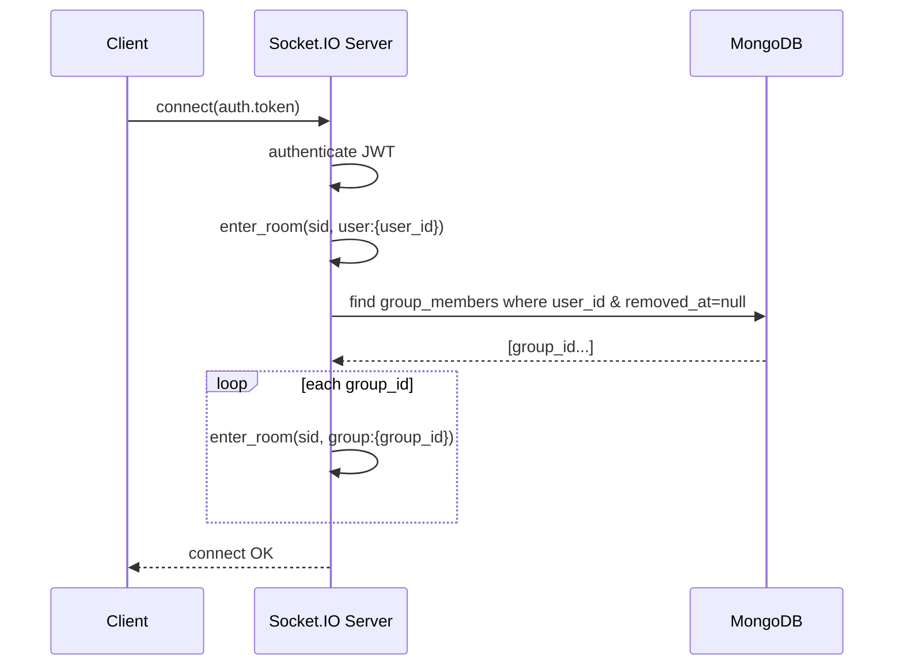
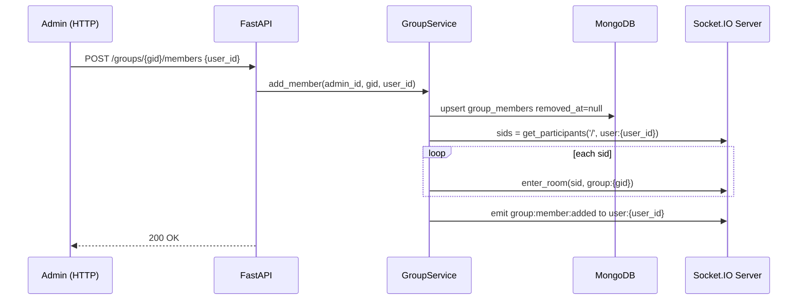
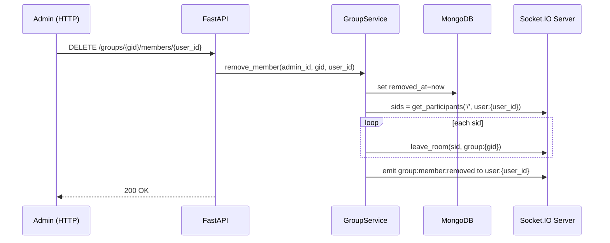
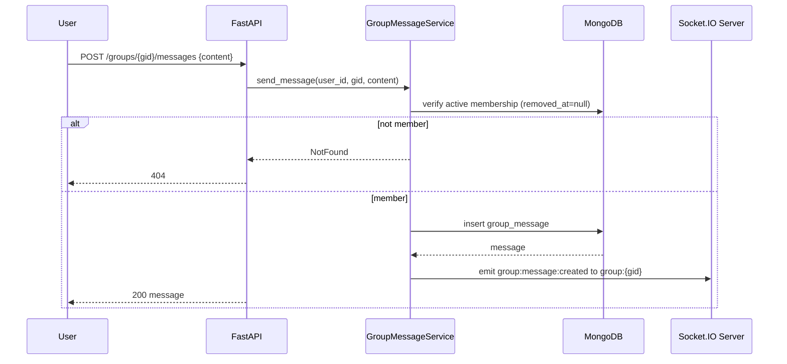

# Group Chat (Admin-managed) — Design

## Overview
This feature adds a **group chat** capability to the existing FastAPI + MongoDB + Socket.IO service:
- **Admins** (global role `admin`) can create groups and manage membership (add/remove any user).
- **Users** can list groups they belong to, send messages, and read message history.
- **Real-time delivery** is done via Socket.IO rooms (`group:{group_id}`).

This design assumes a **single Socket.IO server instance** (no multi-instance orchestration).

### Key references (research)
- python-socketio API reference for `enter_room`, `leave_room`, `rooms`, and manager `get_participants` (including the note about multi-server limitations): https://python-socketio.readthedocs.io/en/stable/api.html
- Socket.IO concept of rooms (join/leave + broadcast): https://socket.io/docs/v2/rooms/

## Architecture

### High-level component diagram
```mermaid
flowchart LR
  FE[Client\n(Web/Mobile)] -->|HTTP (JWT)| API[FastAPI Routers]
  FE -->|Socket.IO (JWT)| SIO[Socket.IO AsyncServer]

  API --> SVC[Services]
  SVC --> REPO[Repositories]
  REPO --> MDB[(MongoDB)]

  SIO --> SVC
  SIO --> REPO
  SIO --> MDB

  SIO -->|emit to rooms| FE
```

### Rooms model (namespace “/”)
- Personal room: `user:{user_id}` (already joined on connect today)
- Group room: `group:{group_id}`

### Authorization model
- Admin HTTP endpoints: `Depends(require_admin)` (existing dependency)
- User HTTP endpoints: `Depends(get_current_active_user)` + service-level membership checks
- Socket.IO connect: JWT auth (existing) + server performs membership room joins
- Message send: server **validates membership in DB** at send-time

## Components and Interfaces

### 1) API layer (FastAPI routers)
All routes live under `/api/v1/`.

#### Admin routes (role: admin)
- `POST /groups`
- `POST /groups/{group_id}/members`
- `DELETE /groups/{group_id}/members/{user_id}`

#### User routes (role: any authenticated active user)
- `GET /groups`
- `GET /groups/{group_id}/messages`
- `POST /groups/{group_id}/messages`

**Design decision (privacy):** for user endpoints, return `404 Not Found` when:
- group does not exist **or**
- group exists but caller is not an active member

This avoids leaking group existence to non-members.

### 2) Service layer (business logic)
Responsibilities:
- Enforce authorization rules (membership checks)
- Orchestrate repo operations (create/update/read)
- Emit Socket.IO events via the Socket server (or the existing gateway wrapper)

Proposed services:
- `GroupService`
  - create_group(admin_id, name) → group (also adds creator as member)
  - add_member(admin_id, group_id, user_id)
  - remove_member(admin_id, group_id, user_id)
  - list_user_groups(user_id, pagination)
  - ensure_member_or_404(user_id, group_id)
- `GroupMessageService`
  - send_message(user_id, group_id, content, client_msg_id?) → message
  - list_messages(user_id, group_id, cursor/limit) → page

### 3) Repository layer (MongoDB access)
Proposed repositories (each maps to one collection):
- `GroupRepository` → `groups`
- `GroupMemberRepository` → `group_members`
- `GroupMessageRepository` → `group_messages`

Repository responsibilities:
- Convert ObjectId ↔ string IDs
- Apply soft-delete filters where needed
- Provide cursor-based pagination queries

### 4) Socket gateway (real-time)
The existing Socket.IO server (`app/socket_gateway/server.py`) already:
- authenticates JWT at connect
- joins `user:{user_id}`

Add to `connect` flow:
- query active group memberships for the user
- join the socket into each `group:{group_id}`

Membership change operations (admin add/remove) must:
- update DB membership
- then update socket rooms for all active connections of the target user:
  - discover all sids that are currently in `user:{user_id}`
  - call `enter_room(sid, group:{group_id})` or `leave_room(...)` for each sid

**SID discovery approach (single-instance):**
- Use python-socketio manager API `get_participants(namespace, room)` against the personal room `user:{user_id}` to obtain all active sids for that user.

## Data Models

### Collections
```typescript
Group {
  _id: string
  name: string
  created_by_admin_id: string
  created_at: datetime
  deleted_at?: datetime | null
}

GroupMember {
  _id: string
  group_id: string
  user_id: string
  joined_at: datetime
  removed_at: datetime | null
  // optional audit fields
  added_by_admin_id?: string
  removed_by_admin_id?: string
  updated_at?: datetime
}

GroupMessage {
  _id: string
  group_id: string
  sender_id: string
  content: string
  client_msg_id?: string
  created_at: datetime
  deleted_at?: datetime | null
}
```

### Indexes
`groups`
- `{deleted_at: 1}` (optional)

`group_members`
- unique `{group_id: 1, user_id: 1}`
- `{user_id: 1, removed_at: 1}` (fast lookup for connect room join + list “my groups”)
- `{group_id: 1, removed_at: 1}` (fast member listing / future features)

`group_messages`
- `{group_id: 1, created_at: -1, _id: -1}` (cursor paging newest-first)
- optional unique `{group_id: 1, sender_id: 1, client_msg_id: 1}` (idempotency if enabled)

### Pagination choice (messages)
Use cursor-based pagination to support unlimited group size:
- Cursor is a tuple `(created_at, message_id)` from the last item in the previous page.
- Ordering: `created_at DESC, _id DESC` for stable deterministic ordering.

## Socket Events & Payloads

### Server → Client events
All payloads include `group_id` for routing on the client.

1) `group:member:added` (to `user:{user_id}`)
```json
{
  "group_id": "string",
  "added_at": "ISO8601"
}
```

2) `group:member:removed` (to `user:{user_id}`)
```json
{
  "group_id": "string",
  "removed_at": "ISO8601"
}
```

3) `group:message:created` (to `group:{group_id}`)
```json
{
  "id": "string",
  "group_id": "string",
  "sender_id": "string",
  "content": "string",
  "created_at": "ISO8601"
}
```

### Client → Server events (optional for MVP)
MVP can send messages over REST only. If sending over socket is desired later:
- `group:message:send` with `{group_id, content, client_msg_id?}`
- Server replies with `group:message:created` broadcast, plus optional ack.

## Flows (sequence diagrams)

### A) Socket connect → join personal room + group rooms


### B) Admin adds user to group → join all active sids into group room


### C) Admin removes user from group → kick all active sids out of group room


### D) User sends message → persist → broadcast to group room


## Components: endpoint-level contracts (summary)

### `POST /api/v1/groups` (admin)
Request:
```json
{ "name": "string" }
```
Response:
```json
{ "id": "string", "name": "string", "created_at": "ISO8601" }
```
Notes:
- Also creates membership for `admin_id` (creator) as active member.

### `POST /api/v1/groups/{group_id}/members` (admin)
Request:
```json
{ "user_id": "string" }
```
Response: `200 OK` (or `201 Created`) with membership summary.
Notes:
- Idempotent.
- Joins all online sockets of that user to `group:{group_id}`.

### `DELETE /api/v1/groups/{group_id}/members/{user_id}` (admin)
Response: `200 OK`.
Notes:
- Idempotent.
- Removes all online sockets of that user from `group:{group_id}`.

### `GET /api/v1/groups` (user)
Response:
```json
{
  "items": [{ "id": "string", "name": "string" }],
  "skip": 0,
  "limit": 20,
  "total": 123
}
```

### `GET /api/v1/groups/{group_id}/messages` (user)
Params:
- `cursor` optional (opaque string encoding `(created_at, id)`), and `limit`
Response:
```json
{
  "group_id": "string",
  "items": [{
    "id": "string",
    "sender_id": "string",
    "content": "string",
    "created_at": "ISO8601"
  }],
  "next_cursor": "string|null"
}
```

### `POST /api/v1/groups/{group_id}/messages` (user)
Request:
```json
{ "content": "string", "client_msg_id": "string|null" }
```
Response:
```json
{
  "id": "string",
  "group_id": "string",
  "sender_id": "string",
  "content": "string",
  "created_at": "ISO8601"
}
```

## Acceptance Criteria Testing Prework

### R1 — Admin creates a group
**Thoughts:** Validate admin-only access, group fields, and auto-membership for creator.  
**Testable:** yes - property | yes - example

### R2 — Admin adds a user to a group
**Thoughts:** Ensure idempotent membership, server room join for online sids, and personal notification.  
**Testable:** yes - property | edge-case

### R3 — Admin removes a user from a group
**Thoughts:** Ensure idempotent removal, server kicks all sids, and removed user loses access (HTTP + socket).  
**Testable:** yes - property | edge-case

### R4 — User lists groups they belong to
**Thoughts:** Ensure only active memberships are listed and pagination limits enforced.  
**Testable:** yes - property | yes - example

### R5 — User sends a message to a group
**Thoughts:** Must membership-check at send time; persist then emit; idempotency optional.  
**Testable:** yes - property | edge-case

### R6 — User reads message history in a group
**Thoughts:** Must membership-check; pagination stable order.  
**Testable:** yes - property | yes - example

### R7 — User receives real-time group messages
**Thoughts:** Connect joins rooms; removal kicks; broadcast reaches only members.  
**Testable:** yes - property | edge-case

### Property Reflection
- Combine “membership required” checks for send/history into one property covering both endpoints.
- Keep separate properties for “kick from room” and “HTTP access denied” because they validate different surfaces (socket vs REST).
- Keep “persist before emit” as its own property to ensure consistency and avoid ghost messages.

## Correctness Properties

### Property 1: Admin-only group management
**Validates: Requirements R1, R2, R3**

For all authenticated users whose role is not `admin`, attempts to create a group, add a member, or remove a member are rejected with `403`.

### Property 2: Creator auto-membership on group creation
**Validates: Requirements R1**

For all successful group creations by an admin `a`, the membership state immediately after creation includes `(group_id, a)` as an active member.

### Property 3: Membership idempotency
**Validates: Requirements R2, R3**

For any admin, group, and user, repeated `add_member` operations result in at most one active membership record, and repeated `remove_member` operations result in the membership being inactive (removed) without creating duplicates.

### Property 4: Membership-gated read/write access (non-leaking)
**Validates: Requirements R3, R5, R6**

For all users and groups, if the user is not an active member of the group, then message history fetch and message send are rejected with `404` (regardless of whether the group exists).

### Property 5: Persist-before-broadcast
**Validates: Requirements R5**

For all valid message sends, the persisted message record exists in the database before a `group:message:created` event is emitted for that message.

### Property 6: Room membership reflects DB membership on connect
**Validates: Requirements R7**

For all socket connections by a user, the set of group rooms joined by the socket after connect equals the set of groups for which the user has active membership at connect time.

### Property 7: Removal stops real-time delivery immediately
**Validates: Requirements R3, R7**

For any user removed from a group, after the removal completes, that user’s active sockets no longer receive `group:message:created` broadcasts emitted to `group:{group_id}`.

### Property 8: Deterministic message ordering
**Validates: Requirements R6**

For any group, message listing returns messages in a deterministic order based on `(created_at, id)` and pagination does not reorder or duplicate messages across pages.

## Error Handling
- Auth failures:
  - HTTP: `401` invalid/missing token
  - Socket: reject connection
- Role violations:
  - HTTP: `403` when non-admin calls admin routes
- Not found / non-member:
  - HTTP user routes: `404` both for “group not found” and “not a member”
- Invalid IDs:
  - Treat invalid ObjectId as `404` for user routes (same non-leaking principle)
- Race conditions:
  - If a user is removed while sending a message, membership check at send-time ensures the request is rejected.

## Testing Strategy

### Unit tests (examples + edge cases)
- Service-level tests:
  - create_group adds creator membership
  - add_member idempotent behavior
  - remove_member idempotent behavior
  - send_message rejects non-members with 404 behavior
- Socket integration boundary tests (mock socket server methods):
  - add_member triggers `enter_room` for all sids in `user:{user_id}`
  - remove_member triggers `leave_room` for all sids

### Property-based tests (Hypothesis, ≥100 iterations each)
- Property tests map 1:1 to correctness properties above:
  - random sequences of add/remove operations preserve idempotency and final membership state
  - non-member access always yields `404` on send/history
  - cursor pagination yields deterministic order without duplicates

### Integration tests (FastAPI + Mongo test DB)
- Happy path: admin creates group, adds user, user sends message, other member receives via socket (can be simulated with socketio test client if available; otherwise test service emit calls).
- Removal path: after remove, send/history denied and socket room membership updated.

---
## Approval Gate
Please review this design. If it looks good, I will produce `tasks.md` with an implementation plan and test breakdown that traces to these properties.

